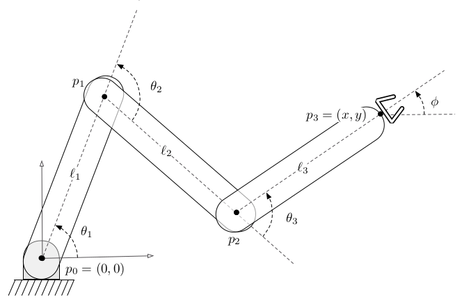

# Motion Planning - Programming Assignment 1

Due: 5/14/2025 (midnight)

The goal of this assignment is to implement foundations for motion planning that are also needed for the upcoming assignments.
Thus, keep your implementation as modular as possible.
Specifically, you will be solving the following parts: forward dynamics computation for a car, visualization of a manipulator robot, and a collision checker.

## Tasks

### Car Dynamics

A simple car has actions $u=(s, \phi) \in \mathcal U$ and states $q=(x, y, \theta) \in \mathcal Q$, see lecture 1 for details including the dynamics. 

Given is a `cfg/car_actions_0.yaml`. The goal is to integrate the dynamics such that we get a file like `cfg/car_plan_0.yaml` by running 

```
python3 car_dynamics.py cfg/car_actions_0.yaml cfg/car_plan_0.yaml
```

For this assignment, it suffices to use Euler integration.

You may visualize the resulting plan using 

```
python3 car_vis.py cfg/car_env_0.yaml cfg/car_plan_0.yaml
```

### Manipulator Visualization

The manipulator is specified by three joint angles, see the following picture.



Given is the sequence of (three) joint angles in `arm_plan.yaml`.

Write the script `arm_vis.py` that visualizes the environment and animates the manipulator. Use `car_vis.py` as inspiration. The script should be able to visualize using

```
python3 arm_vis.py cfg/arm_env_0.yaml cfg/arm_plan_0.yaml
```

### Collision Checking

To check for collisions, you may use the flexible collision library (FCL). This library is written in C++ and Python bindings are readily available, see https://github.com/BerkeleyAutomation/python-fcl.

Write a script that takes `*_env.yaml` and `*_plan.yaml` files, and writes the binary result of the collision checker in an output file. This script should be able to consider both the manipulator and the car dynamics. Use broadphase collision checking.

For example, running

```
python collisions.py cfg/car_env_0.yaml cfg/car_plan_0.yaml collision_car_sol.yaml
```

creates a file, `collision_car_sol.yaml` with the following content:

```yaml
collisions:
- false
- true
- true
- true
```
