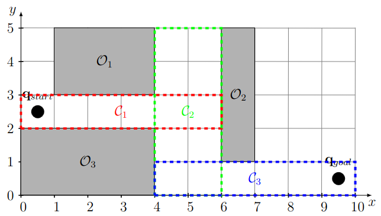

# Motion Planning - Programming Assignment 4

Due: 7/16/2025, 23:59

The goal of this assignment is to use different convex optimization techniques for motion planning.

## Tasks

### Bézier Curve Toy Example (3 pt)

Consider the following geometric motion planning problem, where the goal is to find a $C^2$-continuous curve connecting $\mathbf{q_{\text{start}}}$ and $\mathbf{q_{\text{goal}}}$, while avoiding the obstacles $\mathcal{O}_1$, $\mathcal{O}_2$, and $\mathcal{O}_3$.



Use [CVXpy](https://www.cvxpy.org) to implement the motion planning optimization.

Your code should be executable using

```
python3 opt_toy.py
```

and generate a file `opt_toy.pdf` containing an x/y plot of your resulting Bézier curve and its control points.

#### Hints
First, understand why a spline consisting of three cubic Bézier curve are sufficient for this task.

Second, write down the equations to formulate this motion planning task as a (convex) optimization problem, where you constrain the first piece to stay within $\mathcal{C}_1$, the second to stay within $\mathcal{C}_2$ etc. Make sure you understand what your decision variables are and how many you have.

### Computing Safe Regions (3 pt)

Now assume that you are given an initial solution path (as computed by A* or RRT in the workspace). We want to be able to automatically compute safe convex regions and use those in our optimization.

For the safe regions, we rely on support vector machines that compute hyperplanes that separate each line segment (given by 2 points) from each box obstacle (given by the 4 corner points).

Write a script that takes a yaml file as input which contains a solution path (see `bezier_0.yaml` for an example) and generates a pdf containing a plot of the generated hyperplanes and the resulting Bézier curve. Make sure that your code can handle an arbitrary number of box obstacles and line segments.
Your solution should be executable using:

```
python3 opt_safe.py cfg/bezier_0.yaml bezier_0.pdf
```

#### Background

You can find a visualization of this approach in Lecture 10, slides 50-56.

A support vector machine is the following quadratic program:

$\min_{\mathbf w, b} ||\mathbf{w}||^2_2$ s.t. $\mathbf{w}^T p^o - b \geq 1$ for all points that should be on one side (i.e., corners of an obstacle) and $\mathbf{w}^T p^l - b \leq -1$ for all points that should be on the other side (i.e., endpoints of a line segment).

### Car Case (2 pt)

Now you would like to use the Bézier curve output to plan for a kinodynamic car. Use the differential flatness property to export a plan (with a sequence of states and actions) that fulfill the robot dynamics:

```
python3 opt_safe.py cfg/bezier_0.yaml bezier_0.pdf --export-car bezier_car_plan_0.yaml
```

### Arm Case (2 pt)

Now you would like to use the Bézier curve output to plan for the endeffector of the geometric arm. You can ignore collisions that are caused by the links. Compute the inverse kinematics by inverting the forward kinematics (assignment 1, task 2) and export the sequence of configurations: 

```
python3 opt_safe.py cfg/bezier_0.yaml bezier_0.pdf --export-arm bezier_arm_plan_0.yaml
```
